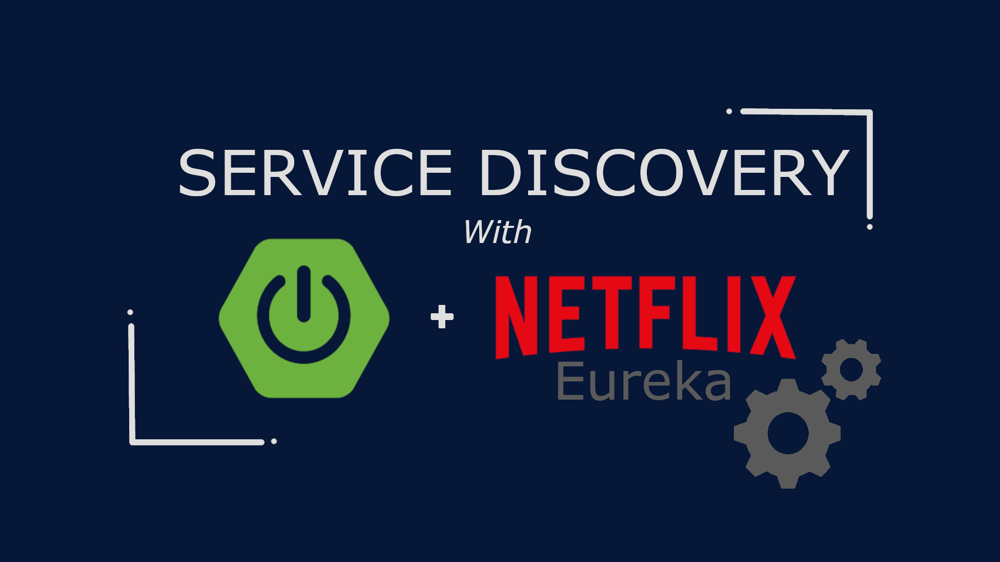

<h1 align="center">ECOSISTEMA INNEO.ORG</h1>

Ambiente completo spring cloud

<ul > 
   <li style="text-decoration-line: none"><a href="https://www.linkedin.com/in/eduardokruz" target="_blank">LINKEDIN EDUARDO CRUZ</a></li>
    
  
   <li style="text-decoration-line: none"><a href="https://youtu.be/OQS8Mn0l_4U?si=oxCF43PKeD6Ur5yS" target="_blank">ECOSSISTEMA SPRING BOOT || AULA 01 || EUREKA-SERVER</a></li>
   <li style="text-decoration-line: none"><a href="#" target="_blank">ECOSSISTEMA SPRING BOOT || AULA 02 || GATEWAY-SERVER</a></li>
   <li style="text-decoration-line: none"><a href="#" target="_blank">ECOSSISTEMA SPRING BOOT || AULA 03 || CONFIG-SERVER</a></li>
</ul>

  

## Tecnologias

Projeto desenvolvido em:
-- JAVA
-- SPRIG BOOT

## Licença

Esse projeto esta sob a licença MIT.

Feito com ❤ por INNEO.ORG

